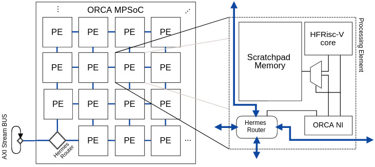

# ORCA MPSOC

ORCA MPSoC is a many-core platform based on the 32-bit Risc-V architecture. It uses [HF-RiscV processor](https://github.com/sjohann81/hf-risc) cores, distributed over a mesh-topology network-on-chip based on the [Hermes NoC](https://www.sciencedirect.com/science/article/abs/pii/S0167926004000185). The ORCA MPSoC architecture, illustrated below, has several configuration parameters related to the number of processing tiles, the size of the internal memory, and several NoC parameters. It also has an AXI stream interface that facilitates it's integration with Xilinx Zynq FPGAs. 

This repository holds the project for the hardware of ORCA MPSoC platform, including their RTL models and simulation scripts for Vivado and Questa (ModelSim) tools. Related repositories are enlisted below.

- ORCA-SIM (https://github.com/andersondomingues/orca-sim), a simulation tool on top of URSA that emulates the ORCA MPSoC
- ORCA-SOFTWARE-ASSETS (https://github.com/andersondomingues/orca-software-assets), applications and libraries to support software development

## Repository organization

This repository is organized as follows.

- `docs`: Folder containing general information about the platform, tutorials and similar documentations.
- `rtl`: Folder containing its RTL models decribed in VHDL. 
- `sim`: Simulation scripts for URSA and Questa tool.
- `syn`: Vivado synthesis projects.
- `test`: Intermediate RTL or testbenches we didn't want to through away. You most probably won't  need anything from here :)

## Project Documentation

Refer to [ORCA MPSoC Hardware Documentation](./docs/mpsoc.md).

## Project Roadmap

Things that we currently working on:

- Prototyping the project to a FPGA 
  
## Licensing

This is free software (and hardware)! See ``LICENSE.MD`` for details. 

## Contact

Feel free to contact me ([andersondomingues](https://github.com/andersondomingues)), the maintainer of this project: mailto:ti.andersondomingues@gmail.com.

## Third-Party Work and Acknowledgement

- HF-RISCV. The hf-riscv core is maintained by Sergio Johann (sjohann81). More information on his work can be found at [his repository](https://github.com/sjohann81). I would like to thank Mr. Johann for the time spent explaining me the depths of the HF-RiscV architecture.

- HERMES. The GAPH group maintains the HERMES network-on-chip. More information on their work can be found at [their website](http://www.inf.pucrs.br/hemps/getting_started.html). Provided network-on-chip router model is based on the RTL models available at [their repository](https://github.com/GaphGroup/hemps). I would like to thank the GAPH group for giving me so many insights on Hermes' architecture. 

- I would to thank Guilherme Heck (https://github.com/heckgui) for his active participation in the first RTL integration of the platform, in special, the design of the network-interface.

- I would to thank Alexandre Amory (https://github.com/amamory) for the advising, preparing the prototyping environment, for providing the FPGA boards, and other resources. 
