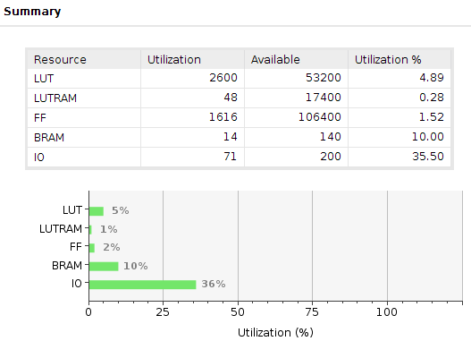
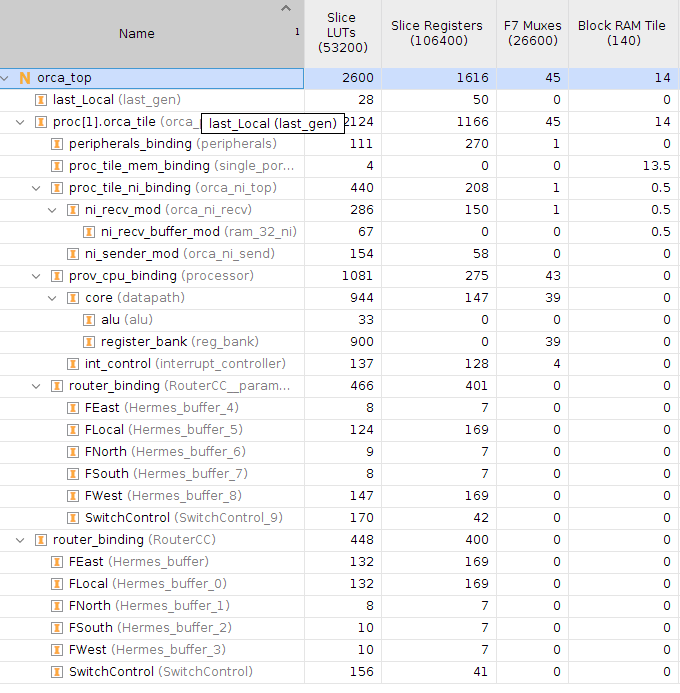
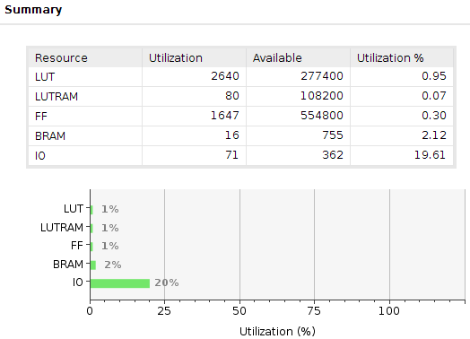
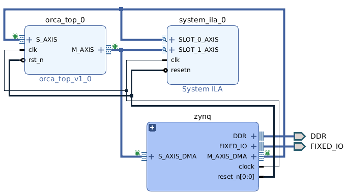
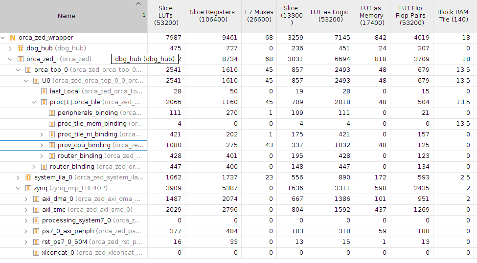

# The ORCA MPSoC

This document describes the ORCA MPSoC. It is a highly parametrizable many-core
which can be connected to the Zynq's ARM processor, working as a parallel co-processor.
The MPSoC consists of tiles, where the tile 0 is always the ARM processor, and the other 
tiles are the [ORCA Processing Tiles](./processing-tile.md). The ORCA tile is a RISC-V 32bits processor with a parametrizable scratchpad memory and interconnected by a Mesh network-on-chip.

## MPSoC Configuration

The ORCA MPSoC has the following configuration parameters in the file *rtl/orca_defaults.vhd*:

    constant TAM_FLIT : integer range 1 to 64 := 32;
    constant TAM_BUFFER: integer := 4;
    constant TAM_BUFFER_DMNI: integer := 16;
    constant NUMBER_PROCESSORS : integer := 2;
    constant NUMBER_PROCESSORS_X : integer := 2;
    constant NUMBER_PROCESSORS_Y : integer := 1;
    constant RAM_ADDR_WIDTH : integer := 14;

They are related to:

    NoC flit width. Typical values: 32 and 16
    NoC input port buffer depth. Typical values: 2, 4, 8
    Network interface buffer depth. Typical values: 8, 16, 32
    Number of processors, including the Zynq's ARM processor. Typical must be NUMBER_PROCESSORS_X * NUMBER_PROCESSORS_Y
    Number of processors in the X axis (Mesh NoC topology). Typical values: [1,8]
    Number of processors in the Y axis (Mesh NoC topology). Typical values: [1,8]
    The size of the internal memory is 2 ^ (RAM_ADDR_WIDTH+2) Bytes.

Follow the presented values for each configuration parameter.

## MPSoC Interface

The *orca-top* module has a AXI Stream interface to connect to the Zynq's ARM subsystem.

The AXI-Stream master interface, i.e., for incoming data flow, has the following interfaces:

    lastM_o:         out std_logic;
    validM_o:        out std_logic;
    dataM_o:         out std_logic_vector(TAM_FLIT-1 downto 0);
    readyM_i:        in  std_logic

The AXI-Stream slave interface, i.e., for outgoing data flow, has the following interfaces:

    validS_i:        in  std_logic;
    dataS_i:         in  std_logic_vector(TAM_FLIT-1 downto 0);
    readyS_o:        out std_logic;

Note that the master interface has an additional port called *last*. This is part of the AXI-S
standard but it is required only for the master interface, and not to the slave interface.

## How to Simulate

Questa must be configured in the $PATH. Then, execute:

    $ cd sim
    $ ./run.sh

## How to Execute the Synthesis

There are two Vivado design located in the *syn* folder. The *orca-top design* is responsible 
to create the orca-top IP block since it includes only the ORCA logic. The *orca-zed design*, 
on the other hand, includes the orca-top and the glue logic to connect it to the ARM processors.
Both designs are detailed below.
### orca-top Design

The Orca Top synthesis is using the default configuration, presented above.
The reference device is xc7z020clg484-1, from the Zedboard. 
The clock constraint is set to 16ns (62.5 MHz).
Vivado 2018.2 must be configured in the $PATH. Then, execute:

    $ cd syn/orca-top/
    $ ./build.sh

You might need to the edit the environment variables in the top of the 
file syn/orca-top/build.sh.

This script will build an entire Vivado project and perform synthesis.
By the end, it will report timing, utilization, and power.

The synthesis presents these utilization results.

Considering these area results, it would be possible to have up to **8 Orca Processing Tiles in a Zedboard**. the main constraint is the amount of BlockRAM to implement the internal memory of each 
Processing Tile.

If we consider another board with more resources, such as [Zynq Mini-ITX](http://zedboard.org/product/mini-itx-board) with the device xc7z100ffg900-2, it would be possible to have **more than 40 Processing Tiles !!!**

The area of an ORCA Processing Tile varies according to its configuration and the position 
of the tile in the MPSoC's Mesh topology. Considering the default configuration, *its area can 
varies from about 2200 LUTs to 2800 LUTs according to the Tile position*. For example, a tile in 
the middle of the Mesh topology has a router with all it's five ports, than it has the maximal 
area. A tile in the corner has three ports, and the minimal router area. A tile in the border of 
the Mesh topology has four ports, and the intermediate router area.

This design is not meant to be used for testing the ORCA MPSoC in the FPGA.

### orca-zed Design 

The ORCA Zed design includes the orca-top design as an IP, plus all the required glue logic to 
attach AXI-stream interfaces to the ARM processors. The figure below presents ORCA Zed's block diagram. 

The next image shows the total utilization per block. One can see that the Zynq Block (Zynq glue logic) uses about twice the number of LUTs compared to the Orca Top design. 

For testing ORCA MPSoC in the Zedboard, one has to use this design.

The ORCA Zed design is executed like the previous design. Just execute these commands to 
start the Vivado:

    $ cd syn/orca-zed/
    $ ./build.sh

## How to Program the FPGA

TODO: Describe here how to load the FPGA and run a program between the ARM and the Processing Tile.

## How to Design new Applications

Refer to the repository [ORCA software](https://github.com/andersondomingues/orca-software) to 
learn how to use ORCA SDK to build new applications.
