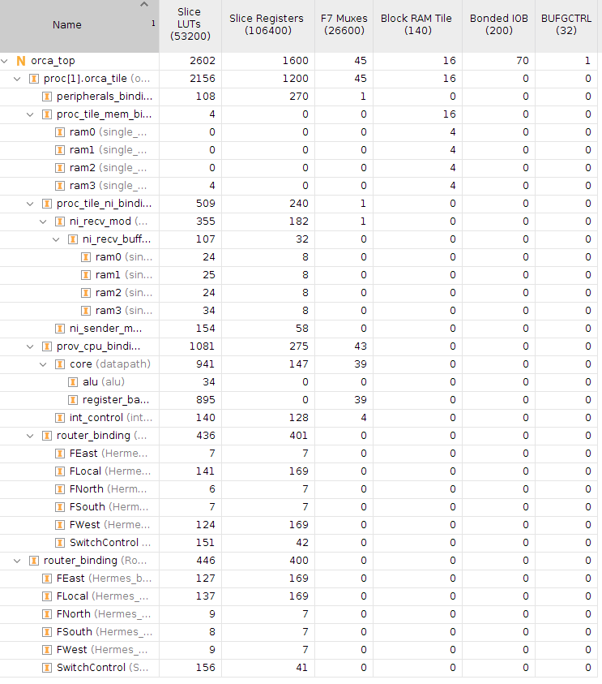
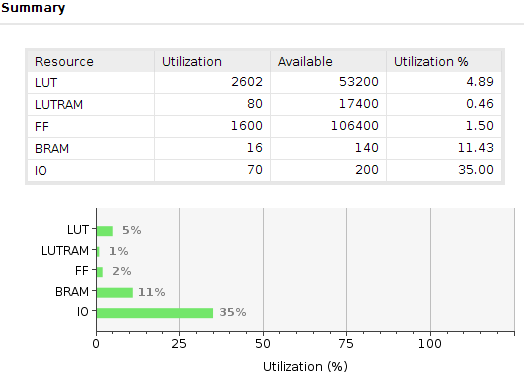
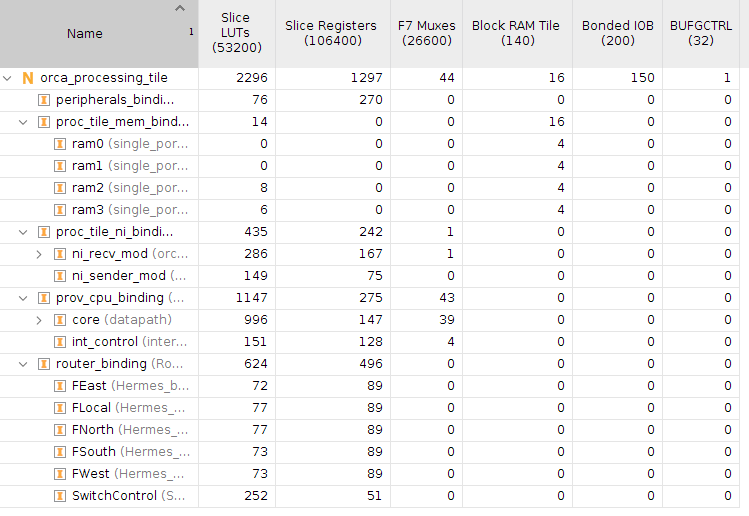

# ORCA Processing Tile

## Tile Interface

## Tile Hierarchy

## Tile Synthesis Results

The synthesis results for a single Orca Processing Tile with memory of 16KBytes, Her router of flit-width of 16 bits, and buffer depth of 4 per router port. The reference device is xc7z020clg484-1, from the Zedboard. The clock constraint is set to 16ns (62.5 MHz).

Considering these area results, it would be possible to have up to 8 Orca Processing Tiles in a Zedboard.

## Programming

Describe here how to run a program between the ARM and the Processing Tile.